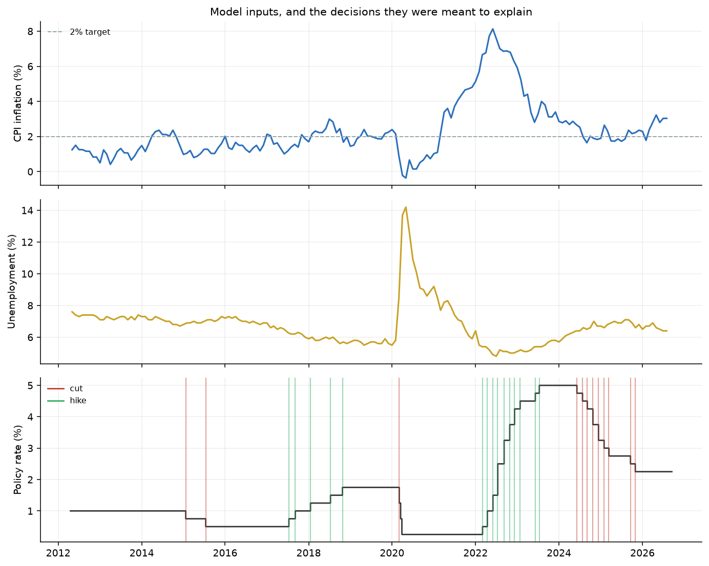
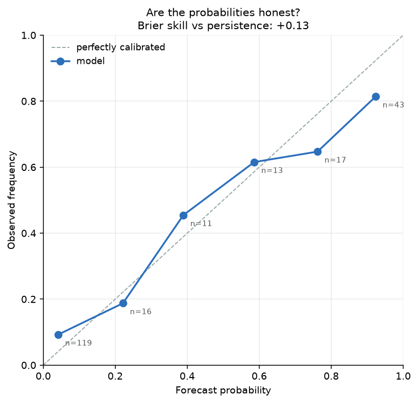

# RateWatch

Probability of a Bank of Canada cut, hold or hike at the next scheduled meeting,
from official CPI, unemployment and policy-rate data published before the decision.

## Next meeting

**2026-10-28**, decided by 2026-10-27 16:00 Toronto.
Forecast from data available at 2026-09-17 02:43 UTC.

| Decision | Probability |
| --- | ---: |
| Cut | 5.2% |
| Hold | 86.3% |
| Hike | 8.6% |

Fitted on 116 earlier meetings. Latest inputs: CPI for 2026-08 (published 2026-09-14), unemployment for 2026-08 (published 2026-09-04), policy rate 2.25%.

## Can it call a change of course?

73 meetings tested, 2017-09-06 to 2026-09-02.
Most meetings repeat the previous decision, so overall accuracy mostly measures how
often nothing happened. This table separates the meetings where something did.

| Meeting type | n | model | frequency | transition | always hold | persistence |
| --- | ---: | ---: | ---: | ---: | ---: | ---: |
| New move | 8 | 0/8 (0%) | 0/8 (0%) | 0/8 (0%) | 0/8 (0%) | 0/8 (0%) |
| Returned to hold | 9 | 6/9 (67%) | 9/9 (100%) | 4/9 (44%) | 9/9 (100%) | 0/9 (0%) |
| Unchanged | 56 | 48/56 (86%) | 40/56 (71%) | 48/56 (86%) | 40/56 (71%) | 56/56 (100%) |

- **New move** The Bank changed course and moved the rate.
- **Returned to hold** The Bank stopped moving and held.
- **Unchanged** The Bank repeated its previous decision.

The 8 meetings where the Bank started or resumed moving the rate: 2018-01-17, 2018-07-11, 2018-10-24, 2020-03-04, 2022-03-02, 2023-06-07, 2024-06-05, 2025-09-17.

The model called 0 of them.

## Overall scores

| Method | Accuracy (95% CI) | Balanced accuracy | Log loss | Brier | Skill vs persistence |
| --- | ---: | ---: | ---: | ---: | ---: |
| model | 74.0% [63.0%, 83.6%] | 51.3% | 0.698 | 0.407 | 0.13 |
| frequency | 67.1% [56.2%, 78.1%] | 33.3% | 0.940 | 0.530 | -0.14 |
| transition | 71.2% [60.3%, 80.8%] | 52.8% | 0.703 | 0.399 | 0.14 |
| always hold | 67.1% [56.2%, 78.1%] | 33.3% | n/a | 0.658 | -0.41 |
| persistence | 76.7% [67.1%, 86.3%] | 72.0% | n/a | 0.466 | 0.00 |

Lower log loss and Brier score are better. Skill is the share of the persistence baseline's squared error removed: 0 means no better, negative means worse.

Log loss is left blank for methods that forecast only 0% or 100%. Their penalty for being wrong depends on the floor used to keep the logarithm finite, not on the forecast, so the number would not be comparable.

What it said on each meeting that changed course:

| Meeting | What the Bank did | Probability it gave that | Probability it gave hold |
| --- | ---: | ---: | ---: |
| 2018-01-17 | hike | 1.9% | 92.6% |
| 2018-07-11 | hike | 3.8% | 94.0% |
| 2018-10-24 | hike | 15.8% | 78.8% |
| 2020-03-04 | cut | 1.9% | 94.2% |
| 2022-03-02 | hike | 10.4% | 86.8% |
| 2023-06-07 | hike | 13.3% | 82.4% |
| 2024-06-05 | cut | 2.2% | 95.8% |
| 2025-09-17 | cut | 12.7% | 85.6% |

An even guess would have given 33% to each option. No baseline called any of these either.

Where the walk-forward predictions landed:

| Actual \ predicted | Cut | Hold | Hike |
| --- | ---: | ---: | ---: |
| **Cut** | 1 | 9 | 0 |
| **Hold** | 0 | 46 | 3 |
| **Hike** | 0 | 7 | 7 |

## Is any difference real?

| Method | Accuracy | Persistence | Difference (95% CI) | Wins/losses | p |
| --- | ---: | ---: | ---: | ---: | ---: |
| model | 74.0% | 76.7% | -2.7% [-12.3%, +6.8%] | 6/8 | 0.791 |
| frequency | 67.1% | 76.7% | -9.6% [-23.3%, +4.1%] | 9/16 | 0.230 |
| transition | 71.2% | 76.7% | -5.5% [-15.1%, +4.1%] | 4/8 | 0.388 |
| always hold | 67.1% | 76.7% | -9.6% [-23.3%, +4.1%] | 9/16 | 0.230 |

The difference is the statistic that matters, and it is measured paired: both methods forecast the same meetings, so the interval comes from resampling meetings and recomputing the gap. An interval straddling zero means this record cannot say which method is better. Comparing each method's own interval instead would be misleading, because two intervals can overlap while the difference is real.

Wins and losses count only the meetings where the two disagreed.

## Forecasts on the record

The sections above are a reconstruction: they use the current, revised CPI
and unemployment figures. Only forecasts written down before a decision are
a clean test.

**meeting-v1**: 1 issued, 0 graded.

## Figures

## Limits

- 2 meetings were dropped for want of usable published inputs.
- Historical figures carry later revisions; release dates are point-in-time, values are not.
- A figure published on the day of a cutoff is treated as unavailable, because the
  release calendar records dates but not times.
- Only scheduled decisions are tested, and six indicators leave out much of what the
  Bank discusses: core inflation measures, the output gap, oil, and US policy.
- This forecasts direction, not the size of a move.
